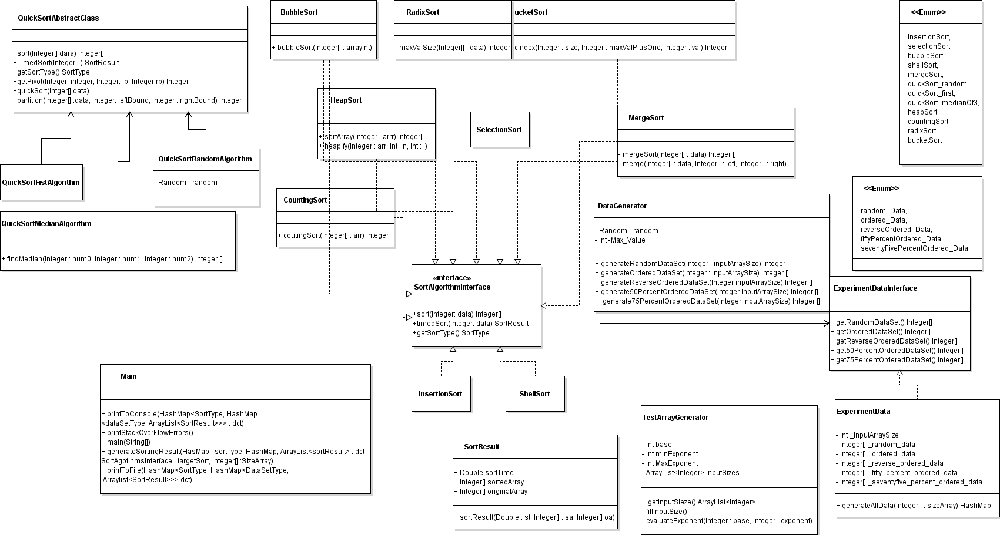
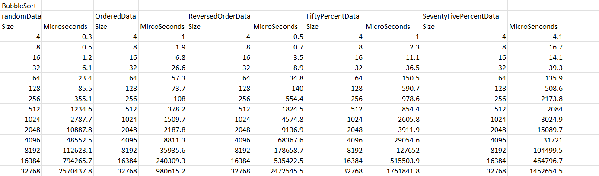
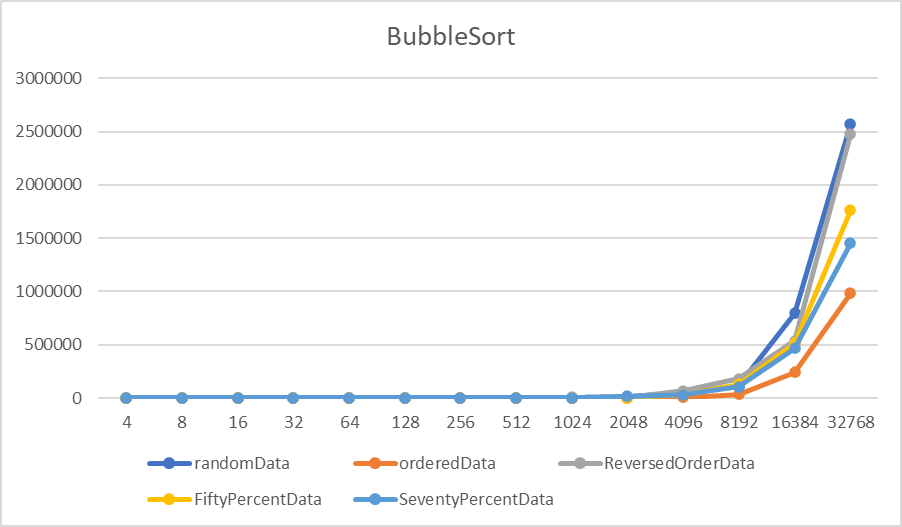
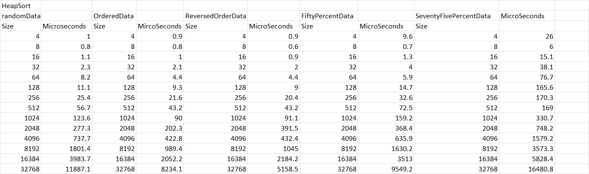
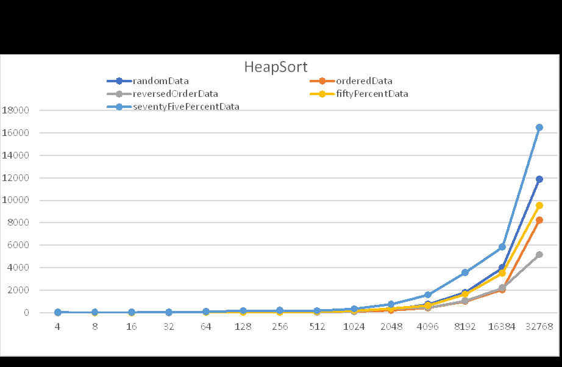
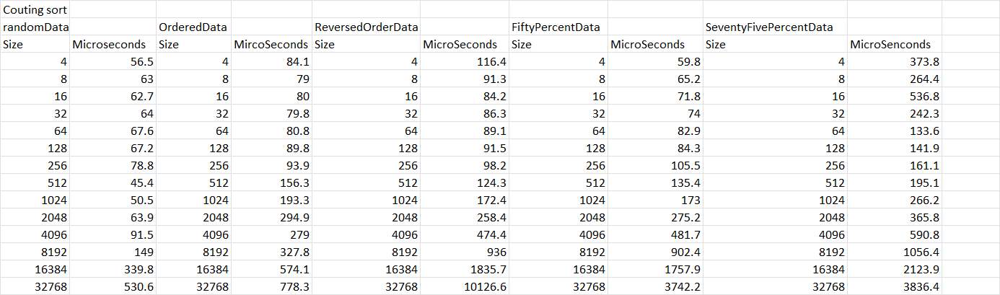
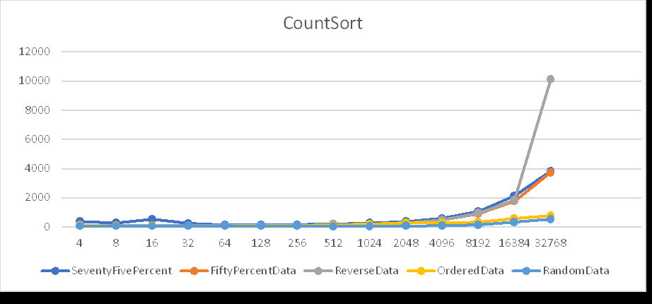

# Project 1: Sorting Algorithms Experiment Final Report (Team Silver)
> This report will cover:
> * Design Decisions
> * Experimental Results
> * Algorithm Analysis
> 
## Team Silver Contributors 
> * M.Barta (Development Manager)
> * J.Damo (Version Control Manager)
> * C.Nickell (Project Manager)
> * D.Ortega (Design Manager)
> 
## Design Decisions
> ### Discuss Reasoning for Organization of Code with UML Diagram (D.Ortega)
> > The silver team decided to implement interfaces, independent classes for each algorithm and all of these 
> classes and interfaces separated into packages to make it more organized. We decided to use an Interface
> as a guideline that we all must implement. Our development manager, Michael Barta did an excellent job creating 
> the code that we needed to generate out arrays and display them the final results in Main. Michael used Enums to
> that provide a small set of fixed, type-safe values which were very helpful for this project. 
> 
> 

> ### Discuss Reasoning for Choosing to Implement the Time of Execution Metric (J.Damo)
> > It is important to understand the run time efficiency of the algorithms especially when a computer takes too long to solve a problem it costs more money and deprives the computer of time for other tasks. Therefore, a algorithm will take different amounts of time on the same inputs depending on such factors as processor speed, instruction set, disk speed, and type of computer. There are three factors for an algorithm to be efficient such as the following:                                   <ol>
  <li>Time efficiency which is a measure of time for an algorithm to execute.</li>
  <li>Space efficiency which is the measure of the amount of memory needed for algorithm to execute.</li>
  <li>Asymptotic dominance which is the comparison of cost functions when n is large.</li>
</ol>
>

> ### Discuss Reasoning for Data Generation and Console Output implementation (M.Barta)
> > some text here
> 
> ### Discuss Reasoning for implementating our Results Visuals with Excel (C.Nickell)
> > some text here
>
## Illustrating Experimental Results
> Each Sorting Algorithm Result Will Include One Table and Five Charts (one for each input configuration)
> 
> ### Insertion Sort (J.Damo)
> > table and charts here
>
> ### Selection Sort (J.Damo)
> > table and charts here
>
> ### Bubble Sort (D.Ortega)

>
> ### Shell Sort (J.Damo)
> > table and charts here
>
> ### Merge Sort (C.Nickell)
> > table and charts here
>
> ### Quick Sort (pivot selected as first element) (M.Barta)
> > table and charts here
>
> ### Quick Sort (pivot selected as random element) (M.Barta)
> > table and charts here
>
> ### Quick Sort (pivot selected with Median-of-three) (M.Barta)
> > table and charts here
>
> ### Heap Sort (D.Ortega)

>
> ### Counting Sort (D.Ortega)

>
> ### Bucket Sort (C.Nickell)
> > table and charts here
>
> ### Radix Sort (C.Nickell)
> > table and charts here
>
## Analyzing Results
> For Each Sorting Algorithm discuss the empirical results with the theoretical results:
>  * Do your findings meet theoretical expectations?
> (David Ortega findings)
> My finding does match the theoretical findings.
> I can make a comparison on each algorithm on each array and each type of data. 
> Looking at the graphs we see that Bubble sort is a very slow algorithm, it can handle data up to a certain point, in this case 5000 elements.
> Once the array size is higher than 5000, we can clearly see the pattern of O(N^2), making it very slow handling large data.
> Counting sort is a very efficient algorithm O(n+k), since it does not operate with comparisons, it has an O(n) time complexity with space proportional to the data range. 
> However, once the elements are high in value, the greater the space complexity is, counting sort’s space complexity is bad if the range as we need to create an auxiliary array. 
> Heap sort algorithm was very efficient and it does matches the theoretical expectations since its big O is O(n log n).
> Heap sort algorithm may be slow in process but is a very effective algorithm.
> It uses the heapify step, which examines every item in the tree moving it downwards until its children are larger or smaller depending on specifications.
> Since the tree height is O(log n), we do O(log n) moves, across all n nodes, making it an overall time complexity of O(n log n).
>
> * Why did you choose the implementations that you did for the sorting algorithms? 
> * (David Ortega)
> * I picked my implementations because they are easy to follow and to understand.
> * In the way my team generated the code, it had to be adjusted on the way it was set up. Other than that my implementations were efficient and easy to follow.
> * Why did you reject other implementations that you researched? 
> * 
> * The only algorithm it was adjusted was counting sort, at first I created two methods and ended using one method and I was able to get the result.
> * Bubble sort can only be done one way and I as far as Heap sort algorithm, I did not explore if it can be done in a different way. 
> * Heap sort algorithm needs one where the array is sorted and the heapify method where recursion is applied and shifts the data type as needed. 
> * All of these questions must be addressed per sorting algorithm.
> 
> ### Insertion Sort (J.Damo)
> > some text here
>
> ### Selection Sort (J.Damo)
> > some text here
>
> ### Bubble Sort (D.Ortega)
> > Bubble sort algorithm is an algorithm that iterates sequentially through a given list and swaps if they aren’t in the correct order. Bubble sort algorithm is not a very efficient algorithm since the run time complexity is O(N^2) for all scenarios best case, worst case and average. 
Number of times it runs in the inner loops:
> 
>=∑_(j=1)^(N-i-1)▒1
=(N-i)
Number of times it runs in the outer loops:
∑_(i=1)^(N-1)▒∑_(j=1)^(N-i-1)▒〖1=∑_(i=i)^(N-1)▒〖N-i〗〗
=(N*(N-1))/2
> 
>Time complexity T(N)			Number of Comparisons C(N)
Number of swaps S(N)

>T(N) = S(N) +C(N)
T(N) = T(N-1) + N
C(N) =  C(N-1) + (N-1)
Worst time complexity:
O(N^2) Is the worst-case time complexity of Bubble sort. This is the case when the list is unsorted or reversed. The number of swaps of two elements is equal to number of comparisons in this case as every element is out of order. 
Best case:
O(N) is the best-case scenario of Bubble sort. This is the case when the list is in order. 
Space complexity:
Bubble sort’s algorithm requires extra variables for flags, temporary variables and thus the space complexity is O(1)

> >
>
> ### Shell Sort (J.Damo)
> > some text here
>
> ### Merge Sort (C.Nickell)
> > some text here
>
> ### Quick Sort (pivot selected as first element) (M.Barta)
> > some text here
>
> ### Quick Sort (pivot selected as random element) (M.Barta)
> > some text here
>
> ### Quick Sort (pivot selected with Median-of-three) (M.Barta)
> > some text here
>
> ### Heap Sort (D.Ortega)
> > The Heap sort algorithm processes the elements by creating the min-heap or max-heap using elements of the given array. Min-heap or Max-heap represents the ordering array in which the root element represents the minimum or maximum element of the array. Heap sort uses recursion to operate:
Build heap, using the element array.
Repeatedly delete the root element of the heap formed in first stage.
T(N) = Time complexity
                       T(n)=∑_(h=0)^lg⁡(N)▒〖O(n)* N/2^(h+1) 〗
                           =O(N* ∑_(h=0)^lg⁡(N)▒〖 h/2^(h+1) 〗)
                           =(N* ∑_(h=0)^lg⁡(N)▒〖 h/〖2*2〗^h 〗)
                           =O(N/2*∑_(h=0)^lg⁡(N)▒h/2^h )
					       =O(N/2 ∑_(h=0)^∞▒〖h/2^h )〗

>Best case:
O(n log n) When no the array is ordered and no sorting is required.
Average case:
O(n log n) When the elements in the array are jumbled, meaning that the array is not organized in neither descending or ascending order. 
Worst case:
O(n log n) When the element in the array are in revered order meaning that depending on the we wish to sort, for example if the array is in ascending order and we want to sort it in descending order we will call it in reverse order. 

>
> ### Counting Sort (D.Ortega)
> > Counting sort algorithm can be used for sorting elements within specific range and is based on the frequency/count of each element to be sorted. 
> It is an integer based, out place and a stable sorting algorithm. 
The overall time complexity is O(n+K)
N = elements in range
K = range of elements
Counting sort algorithm is a non-comparison-based sorting algorithm.
> No matter if the elements in the array are already sorted, reversed sorted or randomly sorted,
> the algorithm works the same for all these cases and this the time complexity for all such cases is the name O(N+k)
Time complexity: O(n+k)
Space complexity: O(k)
Worst case: When data is slanted, and range is large.
Best case: When all elements in the array are the same.
Average case: O(n+k)(n + k)

>
> ### Bucket Sort (C.Nickell)
> > some text here
>
> ### Radix Sort (C.Nickell)
> > some text here
>
